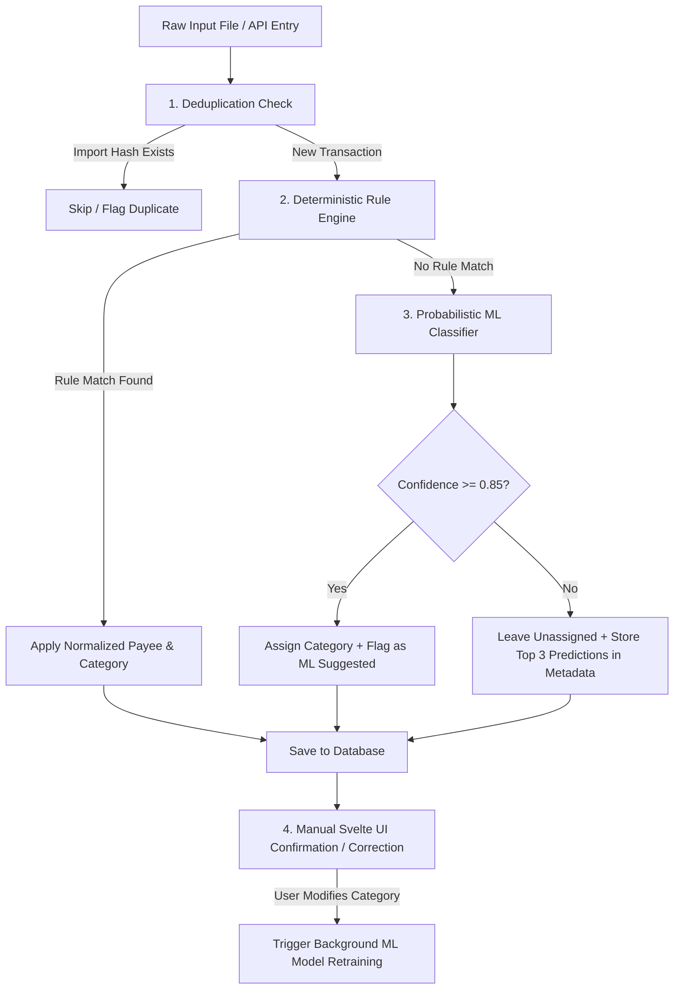

# Technical Implementation Guide: Personal Finance & Budgeting Application

## 1. Technical Architecture & Data Flow

### Architectural Overview
The system is built as a lightweight, responsive client-server application designed for multi-device household usage across desktop and mobile devices. It relies on a modern SvelteKit frontend communicating with a Python FastAPI backend backed by an embedded SQLite database running in Write-Ahead Logging (WAL) mode.

```mermaid
graph TD
    subgraph Client Layer (SvelteKit Frontend)
        MobilePWA["Mobile PWA (SvelteKit + @vite-pwa/sveltekit)"]
        DesktopBrowser["Desktop Browser (SvelteKit App)"]
        NativeApp["Desktop App (Tauri Bundle with SvelteKit UI)"]
    end

    subgraph Host Infrastructure / Network
        Caddy["Caddy Reverse Proxy (TLS Termination, Local HTTPS)"]
    end

    subgraph Backend Server (Python 3.12+ FastAPI)
        FastAPI["FastAPI App (ASGI Engine)"]
        IngestionEngine["Ingestion & Rule Engine"]
        MLEngine["scikit-learn Naive Bayes Model"]
        QueryEngine["Dynamic Query AST Builder"]
    end

    subgraph Data Storage
        SQLite[("SQLite 3 Database\n(WAL Mode Enabled, Cents Integer Storage)")]
    end

    MobilePWA -->|HTTPS / WSS| Caddy
    DesktopBrowser -->|HTTPS / WSS| Caddy
    Caddy -->|Reverse Proxy :8000| FastAPI
    NativeApp -.->|Embedded Local Binding| FastAPI
    FastAPI --> IngestionEngine
    FastAPI --> MLEngine
    FastAPI --> QueryEngine
    IngestionEngine --> SQLite
    QueryEngine --> SQLite
    MLEngine -.->|Read/Write Model State| SQLite
```

### Target Technology Stack

#### Frontend Stack (Svelte Ecosystem)
- **Framework & Routing:** SvelteKit (Svelte 5 / Svelte 4) + TypeScript + Vite.
- **UI Components & Styling:** Tailwind CSS + `shadcn-svelte` / `bits-ui` for accessible, styled UI primitives (modals, dropdowns, popovers, tabs).
- **Data Visualization & Graphs:** `layerchart` (composability charting library for Svelte built on D3 scales) or `chart.js` + `svelte-chartjs` for interactive financial charts (spending over time, income vs. expenses, net worth trajectory, category donut breakdowns).
- **Ledger Data Tables:** `@tanstack/svelte-table` for high-performance financial transaction tables with client-side & server-side sorting, filtering, and pagination.
- **Icons:** `lucide-svelte` for clear financial icons.
- **State Management:** Svelte Stores (`writable`, `derived`) and Svelte 5 Runes (`$state`, `$derived`, `$effect`).
- **PWA & Mobile Support:** `@vite-pwa/sveltekit` for service workers, offline caching, and installation to mobile home screens.
- **Print Layouts:** Clean print-specific stylesheets (`@media print`) for printer-friendly monthly budget summaries and printable financial reports.

#### Backend & Storage Stack
- **Backend Framework:** Python 3.12+ with FastAPI & SQLModel (SQLAlchemy 2.0 async + Pydantic v2).
- **Database Engine:** SQLite 3 with Write-Ahead Logging (`PRAGMA journal_mode=WAL;`). All monetary figures stored strictly as integers (`amount_cents`).
- **Learning Engine:** `scikit-learn` (`TfidfVectorizer` + `MultinomialNB`) for probabilistic category predictions.
- **Deployment & Proxy:** Docker Compose running alongside a host Caddy reverse proxy for local HTTPS.

---

## 2. Relational Database Schema & SQLModel Entities

All monetary values are stored strictly as 64-bit integers representing **cents** (`amount_cents`) to prevent floating-point inaccuracy.

### SQLModel Code Definition (`src/backend/models.py`)

```python
from datetime import date, datetime
from enum import Enum
from typing import Optional, List
from sqlmodel import SQLModel, Field, Relationship
import uuid

class AccountType(str, Enum):
    CHECKING = "checking"
    SAVINGS = "savings"
    CREDIT = "credit"
    INVESTMENT = "investment"

class MatchField(str, Enum):
    RAW_PAYEE = "raw_payee"
    AMOUNT = "amount"
    NOTES = "notes"

class MatchType(str, Enum):
    CONTAINS = "contains"
    EXACT = "exact"
    STARTS_WITH = "starts_with"

# ----------------------------------------------------------------------
# Account Entity
# ----------------------------------------------------------------------
class Account(SQLModel, table=True):
    __tablename__ = "accounts"

    id: uuid.UUID = Field(default_factory=uuid.uuid4, primary_key=True)
    name: str = Field(index=True)
    type: AccountType
    currency: str = Field(default="USD", max_length=3)
    opening_balance_cents: int = Field(default=0)
    opening_date: date
    is_closed: bool = Field(default=False, index=True)
    created_at: datetime = Field(default_factory=datetime.utcnow)

    transactions: List["Transaction"] = Relationship(back_populates="account")

# ----------------------------------------------------------------------
# Category Group & Category Entities
# ----------------------------------------------------------------------
class CategoryGroup(SQLModel, table=True):
    __tablename__ = "category_groups"

    id: uuid.UUID = Field(default_factory=uuid.uuid4, primary_key=True)
    name: str = Field(unique=True, index=True)
    display_order: int = Field(default=0)

    categories: List["Category"] = Relationship(back_populates="group")

class Category(SQLModel, table=True):
    __tablename__ = "categories"

    id: uuid.UUID = Field(default_factory=uuid.uuid4, primary_key=True)
    group_id: uuid.UUID = Field(foreign_key="category_groups.id", index=True)
    name: str = Field(index=True)
    is_income: bool = Field(default=False)
    is_archived: bool = Field(default=False, index=True)

    group: Optional[CategoryGroup] = Relationship(back_populates="categories")
    splits: List["TransactionSplit"] = Relationship(back_populates="category")

# ----------------------------------------------------------------------
# Transaction & Transaction Split Entities
# ----------------------------------------------------------------------
class Transaction(SQLModel, table=True):
    __tablename__ = "transactions"

    id: uuid.UUID = Field(default_factory=uuid.uuid4, primary_key=True)
    account_id: uuid.UUID = Field(foreign_key="accounts.id", index=True)
    date: date = Field(index=True)
    raw_payee: str = Field(index=True)
    normalized_payee: Optional[str] = Field(default=None, index=True)
    amount_cents: int = Field(index=True)  # Negative for expenses, positive for income
    notes: Optional[str] = Field(default=None)
    cleared: bool = Field(default=True)
    import_hash: Optional[str] = Field(default=None, unique=True, index=True)
    is_ml_suggested: bool = Field(default=False)
    ml_confidence: Optional[float] = Field(default=None)
    created_at: datetime = Field(default_factory=datetime.utcnow)

    account: Optional[Account] = Relationship(back_populates="transactions")
    splits: List["TransactionSplit"] = Relationship(back_populates="transaction", sa_relationship_kwargs={"cascade": "all, delete-orphan"})

class TransactionSplit(SQLModel, table=True):
    __tablename__ = "transaction_splits"

    id: uuid.UUID = Field(default_factory=uuid.uuid4, primary_key=True)
    transaction_id: uuid.UUID = Field(foreign_key="transactions.id", index=True)
    category_id: Optional[uuid.UUID] = Field(default=None, foreign_key="categories.id", index=True)
    amount_cents: int  # Must sum up to parent transaction.amount_cents
    notes: Optional[str] = Field(default=None)

    transaction: Optional[Transaction] = Relationship(back_populates="splits")
    category: Optional[Category] = Relationship(back_populates="category")

# ----------------------------------------------------------------------
# Monthly Budget Entity
# ----------------------------------------------------------------------
class MonthlyBudget(SQLModel, table=True):
    __tablename__ = "monthly_budgets"

    id: uuid.UUID = Field(default_factory=uuid.uuid4, primary_key=True)
    month: str = Field(index=True, max_length=7)  # Format: YYYY-MM
    category_id: uuid.UUID = Field(foreign_key="categories.id", index=True)
    budgeted_cents: int = Field(default=0)
    carryover_enabled: bool = Field(default=False)

# ----------------------------------------------------------------------
# Automation & Rule Entity
# ----------------------------------------------------------------------
class Rule(SQLModel, table=True):
    __tablename__ = "rules"

    id: uuid.UUID = Field(default_factory=uuid.uuid4, primary_key=True)
    priority: int = Field(default=0, index=True)
    match_field: MatchField = Field(default=MatchField.RAW_PAYEE)
    match_type: MatchType = Field(default=MatchType.CONTAINS)
    match_value: str
    target_payee: Optional[str] = Field(default=None)
    target_category_id: Optional[uuid.UUID] = Field(default=None, foreign_key="categories.id")
    is_active: bool = Field(default=True, index=True)
```

---

## 3. Transaction Ingestion & Learning Engine Pipeline



### Step 1: Deduplication Logic
Each transaction generates a unique SHA-256 signature calculated from:
$$\text{import\_hash} = \text{SHA256}(\text{account\_id} \mathbin{\Vert} \text{date} \mathbin{\Vert} \text{amount\_cents} \mathbin{\Vert} \text{raw\_payee})$$
If an incoming row matches an existing `import_hash`, it is flagged as a duplicate and excluded from insertion unless overridden by the user.

### Step 2: Deterministic Rule Execution Engine
Rules are executed in ascending order of `priority`. When matching `raw_payee`:
- `exact`: `raw_payee.lower() == match_value.lower()`
- `starts_with`: `raw_payee.lower().startswith(match_value.lower())`
- `contains`: `match_value.lower() in raw_payee.lower()`

When a match succeeds, `normalized_payee` and `target_category_id` are applied immediately, bypassing ML evaluation.

### Step 3: Probabilistic Machine Learning Engine (`scikit-learn`)
When a transaction remains uncategorized after rule processing:
- **Feature Extraction:** `TfidfVectorizer(ngram_range=(1, 3), analyzer='char_wb')` tokenizes raw payee text.
- **Classification:** `MultinomialNB()` calculates category probability vector $P(C_k \mid \text{payee})$.
- **Confidence Thresholding:**
  - If $\max P(C_k) \ge 0.85$, category $C_k$ is automatically assigned (`is_ml_suggested = True`, `ml_confidence = score`).
  - If $\max P(C_k) < 0.85$, top 3 predictions are returned in metadata for Svelte UI suggestion buttons.

---

## 4. Dynamic Query Builder & Reporting Specification

### JSON AST Schema
The Svelte visual query builder generates nested logical trees formatted as JSON AST:

```json
{
  "operator": "AND",
  "rules": [
    { "field": "date", "operator": "gte", "value": "2026-01-01" },
    { "field": "date", "operator": "lte", "value": "2026-12-31" },
    {
      "operator": "OR",
      "rules": [
        { "field": "category_id", "operator": "eq", "value": "uuid-housing-cat" },
        { "field": "amount_cents", "operator": "lt", "value": -50000 }
      ]
    }
  ]
}
```

### AST-to-SQLModel Query Translator Implementation

```python
from sqlmodel import select
from sqlalchemy import and_, or_
from models import Transaction, TransactionSplit

def build_sqlalchemy_criterion(ast_node: dict):
    if "operator" in ast_node and ast_node["operator"].upper() in ("AND", "OR"):
        sub_criteria = [build_sqlalchemy_criterion(rule) for rule in ast_node["rules"]]
        return and_(*sub_criteria) if ast_node["operator"].upper() == "AND" else or_(*sub_criteria)

    field_name = ast_node["field"]
    op = ast_node["operator"]
    val = ast_node["value"]

    # Field mapping
    field_map = {
        "date": Transaction.date,
        "amount_cents": Transaction.amount_cents,
        "raw_payee": Transaction.raw_payee,
        "normalized_payee": Transaction.normalized_payee,
        "account_id": Transaction.account_id,
        "category_id": TransactionSplit.category_id,
    }

    column = field_map[field_name]

    if op == "eq": return column == val
    if op == "neq": return column != val
    if op == "gt": return column > val
    if op == "gte": return column >= val
    if op == "lt": return column < val
    if op == "lte": return column <= val
    if op == "contains": return column.ilike(f"%{val}%")
    if op == "starts_with": return column.ilike(f"{val}%")
    
    raise ValueError(f"Unsupported operator: {op}")
```

### Reporting Calculations

1. **Rolling N-Month Average Budget Calculator:**
   $$\text{TargetBudget}(C_i) = \frac{1}{N} \sum_{m=1}^{N} \text{ActualExpenses}(C_i, \text{Month}_{-m})$$
2. **Category Balance Rollover:**
   $$\text{Available}(C_i, M) = \text{Budgeted}(C_i, M) + \text{Rollover}(C_i, M-1) + \text{Actual}(C_i, M)$$
3. **Streaming CSV Export Endpoint:** Uses FastAPI `StreamingResponse` with Python's `csv.writer` to stream dynamic query results row-by-row without buffering large datasets in RAM.

---

## 5. Implementation Roadmap & Project Structure

### Folder Structure (SvelteKit + FastAPI)

```
budget/
├── plan/
│   ├── user_stories.md
│   └── implementation_plan.md
├── docker-compose.yml
├── Caddyfile
└── src/
    ├── backend/
    │   ├── main.py
    │   ├── database.py
    │   ├── models.py
    │   ├── routers/
    │   │   ├── accounts.py
    │   │   ├── transactions.py
    │   │   ├── imports.py
    │   │   ├── rules.py
    │   │   ├── budgets.py
    │   │   └── reports.py
    │   ├── services/
    │   │   ├── ingestion.py
    │   │   ├── ml_engine.py
    │   │   ├── query_builder.py
    │   │   └── rollover.py
    │   └── tests/
    └── frontend/
        ├── package.json
        ├── svelte.config.js
        ├── vite.config.ts
        ├── tailwind.config.js
        ├── static/
        │   ├── manifest.json       # PWA Configuration
        │   └── favicon.png
        └── src/
            ├── app.html
            ├── app.d.ts
            ├── lib/
            │   ├── components/
            │   │   ├── ui/         # shadcn-svelte / bits-ui primitives
            │   │   ├── ledger/     # TanStack Svelte Table ledger views
            │   │   ├── charts/     # Layerchart / svelte-chartjs components
            │   │   ├── query/      # Visual Query Builder AST Svelte components
            │   │   └── budget/     # Monthly budget grid & navigation
            │   ├── stores/         # Svelte state stores / runes
            │   ├── api.ts          # Fetch client wrapper for FastAPI endpoints
            │   └── utils/
            ├── routes/
            │   ├── +layout.svelte
            │   ├── +page.svelte    # Dashboard with Layerchart visualizations
            │   ├── accounts/
            │   ├── ledger/
            │   ├── budget/
            │   ├── query/
            │   └── reports/
            └── styles/
                └── print.css       # @media print rules for printable reports
```

---

## Progressive Milestones & Tracking Matrix

Legend: `[ ]` Pending | `[🔄]` In Progress | `[x]` Completed

### Milestone 1: Core Foundation & Ledger Backend (US-1.1, US-1.2, US-1.3, US-1.4)
- [x] **1.1 SQLite WAL Database Setup & SQLModel Entities**
  - Configure SQLite engine with `PRAGMA journal_mode=WAL;` and integer `amount_cents` fields.
- [x] **1.2 Account Management CRUD (US-1.1)**
  - REST API & SvelteKit UI for managing checking, savings, and credit accounts.
- [x] **1.3 Ledger Table & Account Filtering (US-1.2)**
  - `@tanstack/svelte-table` implementation with toggle between "All Accounts" and single account views.
- [x] **1.4 Quick Manual Entry & Split Transactions (US-1.3, US-1.4)**
  - Mobile-responsive Svelte entry form and split transaction validation modal.

### Milestone 2: Bank Statement Ingestion & Deterministic Rules (US-2.1, US-2.2, US-2.3, US-3.1, US-3.2)
- [x] **2.1 CSV & QFX/OFX Parsers (US-2.1)**
  - Parsing engines for raw bank exports.
- [x] **2.2 Interactive Column Mapper Svelte UI (US-2.2)**
  - Dynamic mapping interface to map bank headers to Date, Payee, and Amount fields.
- [x] **2.3 Hash-Based Duplicate Detection (US-2.3)**
  - Deduplication signature matching on SHA-256 hashes.
- [x] **2.4 Priority Rule Engine & Retroactive Execution (US-3.1, US-3.2)**
  - Rule evaluation (`exact`, `contains`, `starts_with`) with option to reprocess history.

### Milestone 3: scikit-learn Naive Bayes Categorizer (US-3.3, US-3.4)
- [x] **3.1 Machine Learning Categorization Service (US-3.3)**
  - `TfidfVectorizer` + `MultinomialNB` pipeline with probability score extraction.
- [x] **3.2 One-Click Category Confirmation in Svelte UI (US-3.4)**
  - Visual confidence badge, one-click confirmation UI, and background model retraining.

### Milestone 4: Budget Planning & Rolling Averages (US-4.1, US-4.2, US-4.3, US-4.4, US-4.5, US-4.6)
- [x] **4.1 Category Hierarchy & Historical Navigation (US-4.1, US-4.3)**
  - Category groups setup and monthly navigation component.
- [x] **4.2 Rolling N-Month Average Spreading (US-4.2)**
  - Auto-calculation of category targets from historical spending.
- [x] **4.3 Category Rollover & Savings Surpluses (US-4.4, US-4.5)**
  - Carryover balance calculations and surplus transfer to savings accounts.
- [x] **4.4 Category Creation, Customization & Removal (US-4.6)**
  - Dynamic category & category group creation, editing, and soft/hard deletion endpoints.

### Milestone 5: Visual Query Builder, Dashboards & PWA Deployment (US-5.1, US-5.2, US-5.3, US-5.4, US-6.1, US-6.2)
- [x] **5.1 Svelte Visual Query Builder & Streaming CSV Export (US-5.1, US-5.2)**
  - Dynamic JSON AST query component and memory-efficient CSV export.
- [x] **5.2 Financial Reports & Layerchart / Chart.js Visualizations (US-5.3, US-5.4)**
  - Spending trends, income vs. expense, and net worth charts; `@media print` layout.
- [x] **5.3 SvelteKit PWA (@vite-pwa/sveltekit) & Multi-User Concurrency (US-6.1, US-6.2)**
  - Web App Manifest, PWA icons, WAL busy timeout pragma, and responsive multi-device design.

---

## User Story Coverage Verification Matrix

| User Story | Name | Milestone | Status |
| :--- | :--- | :--- | :--- |
| **US-1.1** | Multi-Account Management | Milestone 1 | `[x] Completed` |
| **US-1.2** | Unified vs. Account-Specific Views | Milestone 1 | `[x] Completed` |
| **US-1.3** | Manual Transaction Entry | Milestone 1 | `[x] Completed` |
| **US-1.4** | Split Transactions | Milestone 1 | `[x] Completed` |
| **US-2.1** | File-Based Transaction Import | Milestone 2 | `[x] Completed` |
| **US-2.2** | Column Mapping Interface | Milestone 2 | `[x] Completed` |
| **US-2.3** | Duplicate Detection | Milestone 2 | `[x] Completed` |
| **US-3.1** | Explicit Rule Definition | Milestone 2 | `[x] Completed` |
| **US-3.2** | Retroactive Rule Application | Milestone 2 | `[x] Completed` |
| **US-3.3** | Probabilistic Category Suggestions (Naive Bayes) | Milestone 3 | `[x] Completed` |
| **US-3.4** | One-Click Category Acceptance | Milestone 3 | `[x] Completed` |
| **US-4.1** | Category & Category Group Setup | Milestone 4 | `[x] Completed` |
| **US-4.2** | Multi-Month Average Spreading | Milestone 4 | `[x] Completed` |
| **US-4.3** | Historical Month Navigation | Milestone 4 | `[x] Completed` |
| **US-4.4** | Category Balance Rollover | Milestone 4 | `[x] Completed` |
| **US-4.5** | Category Balance Transfer to Savings | Milestone 4 | `[x] Completed` |
| **US-4.6** | Category Creation, Customization & Removal | Milestone 4 | `[x] Completed` |
| **US-5.1** | Custom Visual Query Builder | Milestone 5 | `[x] Completed` |
| **US-5.2** | Query Result CSV Export | Milestone 5 | `[x] Completed` |
| **US-5.3** | Spending Reports & Dashboards | Milestone 5 | `[x] Completed` |
| **US-5.4** | Printer-Friendly Reporting | Milestone 5 | `[x] Completed` |
| **US-6.1** | Mobile Progressive Web App (PWA) | Milestone 5 | `[x] Completed` |
| **US-6.2** | Concurrent Multi-User Access | Milestone 5 | `[x] Completed` |
